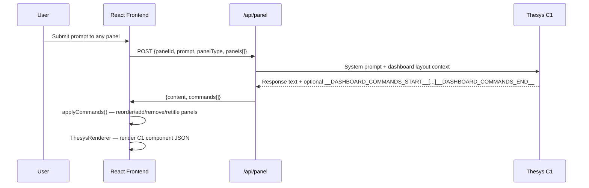

<div align="center">

# Thesys C1 Developer Dashboard

**An AI agent that controls its own dashboard layout via structured JSON commands**

[](https://nextjs.org)
[](https://www.typescriptlang.org)
[](https://thesys.dev)
[](https://tailwindcss.com)
[](https://vercel.com)

</div>

---

## What Makes This Different

Most AI dashboards let you chat with a bot that *describes* data. This one lets the agent *restructure the dashboard itself* — add panels, remove panels, reorder them, switch between rich C1 UI and plain chat mode — all via a structured JSON command protocol embedded in the AI's response.

The agent isn't just answering questions. It's managing its own workspace.

---

## Dashboard Control Protocol

Every AI response can include a JSON command block that the frontend processes live:



### Command Types

```ts
type DashboardCommand =
  | { type: 'reorder';    order: string[] }
  | { type: 'update';     id: string; content: string; title?: string }
  | { type: 'add_panel';  panel: { type: 'c1' | 'chat'; title: string } }
  | { type: 'remove_panel'; id: string }
  | { type: 'set_input';  id: string; hasInput: boolean }
  | { type: 'set_type';   id: string; panelType: 'c1' | 'chat' }
  | { type: 'set_title';  id: string; title: string }
```

---

## Two Panel Types

| Type | Description |
|---|---|
| **C1 Panel** | Thesys C1 renders rich generative UI — tables, status badges, colored rows, interactive form elements |
| **Chat Panel** | Plain markdown conversation — the C1 JSON tree is walked and converted to readable text |

Both types can be added, removed, and toggled in the same grid at runtime.

---

## Named Panel Prompts

Six pre-configured dashboard panels, each with a detailed system prompt specifying exact UI layout, color scheme, data fields, and interactive element suggestions:

| Panel | What it generates |
|---|---|
| **Pull Requests** | Status badges, branch targets, comment counts, age |
| **CI/CD Pipeline** | Run history, test coverage bar, success rate |
| **Issues & Bugs** | Priority color-coding, assignees, label chips |
| **System Logs** | Terminal-style timestamped entries, level badges |
| **Team Activity** | Activity feed with action verbs, actor avatars |
| **Deployments** | Environment status cards + recent deploy list |

---

## Interactive Form Detection

C1 panels can contain rendered form elements (`input`, `select`, `[role="slider"]`). `DashboardPanel` uses a `MutationObserver` to watch for these asynchronously after the C1 SDK renders:

```ts
// Detect interactive elements in C1-rendered content
const observer = new MutationObserver(checkForInteractive);
observer.observe(contentRef.current, {
  childList: true, subtree: true, attributes: true
});
```

When detected, a **Save & Submit** footer appears. On click, all form values are collected and sent back to the agent as a structured follow-up prompt.

---

## Tech Stack

<div align="center">

&nbsp;
&nbsp;


</div>

---

## Setup

```bash
git clone https://github.com/pappdavid/thesys-c1-dashboard.git
cd thesys-c1-dashboard
npm install
cp .env.example .env.local
# Add THESYS_API_KEY from https://chat.thesys.dev/console/keys
npm run dev
```

Open [http://localhost:3000/dashboard](http://localhost:3000/dashboard).

---

## Project Structure

```
lib/
  thesys-client.ts      # API client, named panel prompts, command parser,
                        # C1 JSON → markdown extractor, Dashboard Control Protocol
  panel-config.ts       # Client-safe panel metadata

components/
  DashboardPanel.tsx    # Per-panel component with DnD, type toggle,
                        # MutationObserver form detection, Save & Submit
  ThesysRenderer.tsx    # C1 SDK wrapper (client-only, dynamic import)
  DashboardLayout.tsx   # KPI row + panel grid + toolbar
  ChatContent.tsx       # Markdown renderer for chat panels

pages/
  dashboard.tsx         # State management, applyCommands(), drag-and-drop,
                        # auto-load on mount, add/remove panel handlers
  api/panel.ts          # Unified panel endpoint (named + generic + chat)
  api/dashboard.ts      # Legacy single-panel endpoint
```

---

## CI/CD

GitHub Actions workflows:
- **`ci.yml`** — lint, typecheck, build on every push
- **`deploy.yml`** — production deploy on `main`, preview URL on PRs
